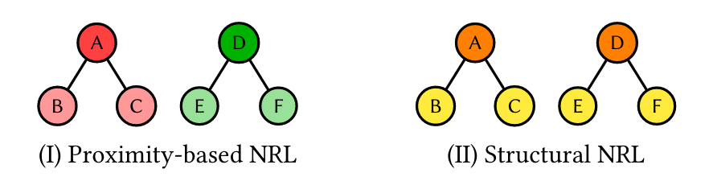

# SparseStruct


This repository provides a general implementation of SparseStruct as described in the paper:
[Large-scale Sparse Structural Node Representation](https://ieeexplore.ieee.org/document/9377854)

Edoardo Serra, Mikel Joaristi, Alfredo Cuzzocrea

 but includes adaptations which allow for labeled nodes and weighted edges, a reference implementation of **LabeledSparseStruct**. Additionally, **ExplanationSparseStruct** is included, which generates importance scores for specific graph edges.  These are described in the paper:

[The geometrical shapes of violence: predicting and explaining terrorist operations through graph embeddings](https://academic.oup.com/comnet/article-abstract/10/2/cnac008/6564024)

Gian Maria Campedelli, Janet Layne, Jack Herzoff, and Edoardo Serra.

<p align="center"></p>

The SparseStruct algorithm generates node representations based upon the structural characteristics of node's neighborhoods. 
An implementation for directed graphs is in development. 

## Citing
If you make use of the SparseStruct or Explanation algorithm in your research, please cite the following paper:
```bibtex
@article{10.1093/comnet/cnac008,
    author = {Campedelli, Gian Maria and Layne, Janet and Herzoff, Jack and Serra, Edoardo},
    title = "{The geometrical shapes of violence: predicting and explaining terrorist operations through graph embeddings}",
    journal = {Journal of Complex Networks},
    volume = {10},
    number = {2},
    year = {2022},
    month = {04},
    issn = {2051-1329},
    doi = {10.1093/comnet/cnac008},
    url = {https://doi.org/10.1093/comnet/cnac008},
    eprint = {https://academic.oup.com/comnet/article-pdf/10/2/cnac008/43290087/cnac008.pdf},
}
```

## Publication Dataset

The Terror Group dataset used for this publication has a different format than the general-use SparseStruct code takes as input. To obtain SparseStruct node representations for the nodes (considering its weighted edges and node features), simply run : 
```bash
python LabeledSparseStruct.py
```

## Undirected

This implementation works for undirected graphs. An implementation for directed graphs is in development.

### Usage
From the command line:
```bash
python SparseStruct.py --input --output --nodefeat --weighted --stop --depth --rep  
```
where:
* --weighted indicator whether the input graph contains weighted edges
* --stop indicator whether the algorithm will stop at convergence rather than go to a user input depth
* --rep is the desired final dimensionality of the node representations
* --depth is the number of iterations, which corresponds to the depth of neighborhood exploration upon which each node's representation is based (note that if stop = True then the algorithm will run to convergence regardless of depth input)
For example:
```bash
python SparseStruct.py --input fileneame --output filename --labels filename --weighted --depth 10 --rep 20  
```
or
```bash
python SparseStruct.py --input fileneame --output filename --stop --rep 20  
```

#### Input

SparseStruct expects in input comma separated edgelist with headers in the form of: <br>

	nodeID1, nodeID2, weight
	
Note: If --weighted is False, no weights will be read even if they are present in the file.

If $X$ node features are present, SparseStruct expects in input a comma separated numerical features file in the form of: <br>

	nodeID, feature1, feature2, ..., featureX

Should your node features be categorical, please use the OneHot Encoder from sklearn to transform them, then save as a csv for input to SparseStruct.py.

#### Output

Output will be a space separated file of dimensions *n x k* for a graph with *n* vertices, where *k* is the node representation size of the format:

    nodeID dim1 dim2 ... dimk

## DirectedSparseStruct
In development

## ExplanationSparseStruct

This algorithm generates the explanation for classification of a SparseStruct node representation. This current implementation runs an Extra Trees Classifier on a graph classification task and returns importance values for each correctly classified edge in the graph.

## Usage

### Input

The supported input format is currently only the dataset used for the publication. A version for general input is in development. This algorithm runs LabeledSparseStruct and as the neighborhood is explored for each node, collects information about which features represent which edges being explored. As such, this is run as a standalone program, not as an addon to the LabeledSparseStruct algorithm. If no explanation is required, and only an embedding, LabeledSparseStruct is much faster due to the use of the Lime explainer for each node.

### Example

To run *SparseStructExplanation* :<br/>
	``python ExplanationSparseStruct.py``


### Output

Output is a nested dictionary with the group and timestamp as a tuple outer key, inner key is (node1_id, node2_id) and value is importance score.
